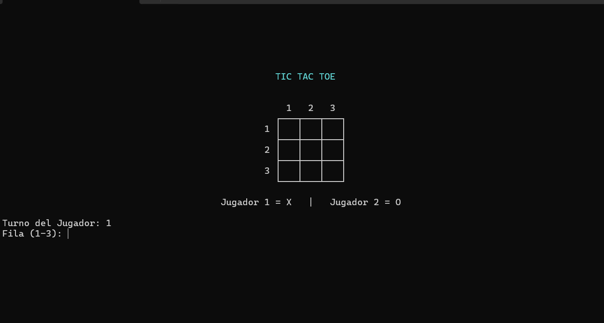
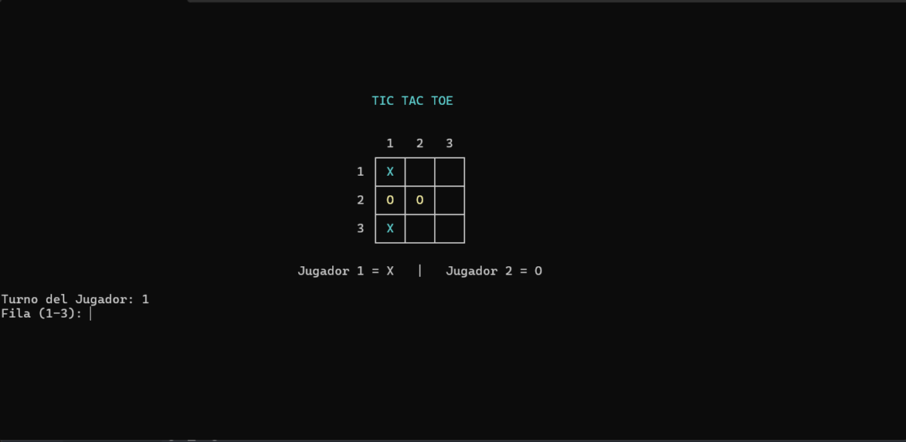
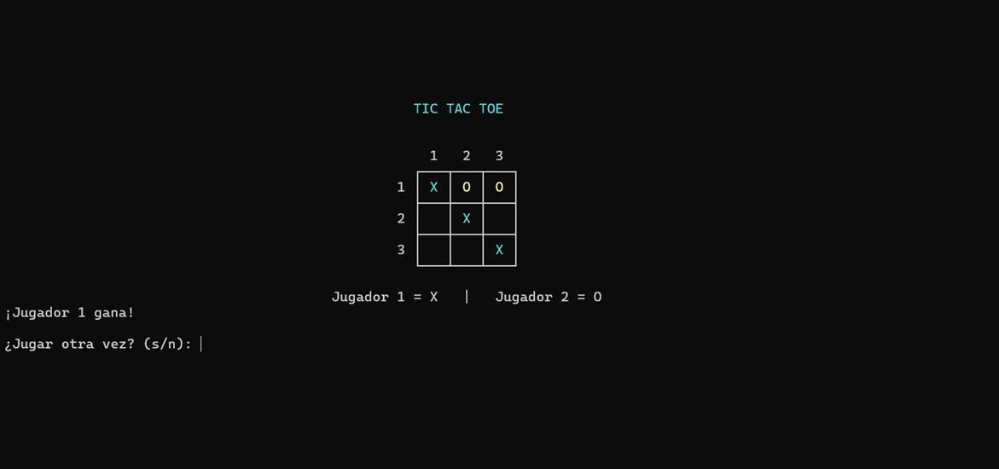

# 🎮 Tic Tac Toe (Juego del Gato) en C#

Aplicación de consola desarrollada en C# que implementa el clásico juego **Tic Tac Toe (Gato)** con una interfaz mejorada dentro de la terminal.

---

## ✨ Características

* Tablero centrado en consola
* Interfaz con bordes Unicode
* Colores para diferenciar jugadores (X y O)
* Validación de entradas (solo valores 1-3)
* Detección automática de ganador
* Detección de empate
* Mensajes claros para el usuario

---

## 🚀 Cómo ejecutar el proyecto

### 🔹 Requisitos

* Tener instalado **.NET SDK** (recomendado .NET 6 o superior)

Puedes verificarlo con:

```bash
dotnet --version
```

---

### 🔹 Clonar el repositorio

```bash
git clone https://github.com/Freddyp666/VideoJuegoGato.git
cd TU-REPO
```

---

### 🔹 Ejecutar el proyecto

```bash
dotnet run
```

---

## 🎮 Cómo jugar

1. El juego es para **2 jugadores**
2. Cada jugador elige una posición ingresando:

   * Fila (1-3)
   * Columna (1-3)
3. El jugador 1 usa **X**
4. El jugador 2 usa **O**
5. Gana quien forme una línea de 3 (horizontal, vertical o diagonal)

---

## 🧠 Ejemplo de uso

```
Turno del Jugador: 1
Fila (1-3): 2 | Columna (1-3): 3
```

---

## 📁 Estructura del proyecto

```
📦 VideoJuegoGato
 ┣ 📜 Program.cs
```

---

## 🛠️ Tecnologías utilizadas

* C#
* .NET
* Consola (CLI)

---


## 🖼️ Vista previa

### Inicio del juego


### Juego en progreso


### Resultado final
